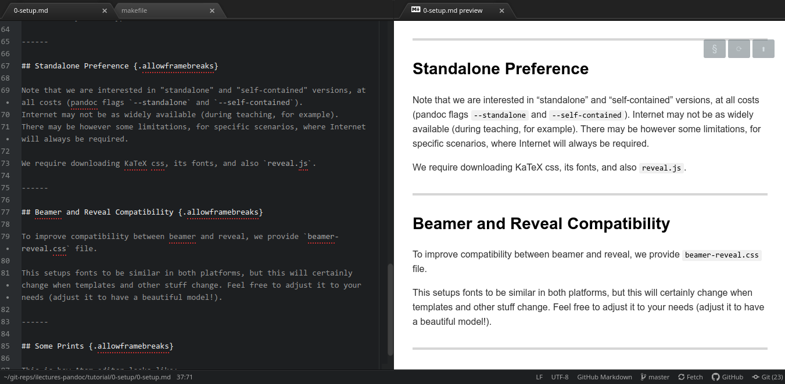
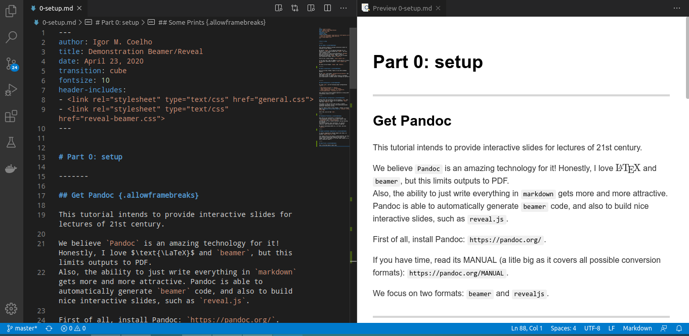
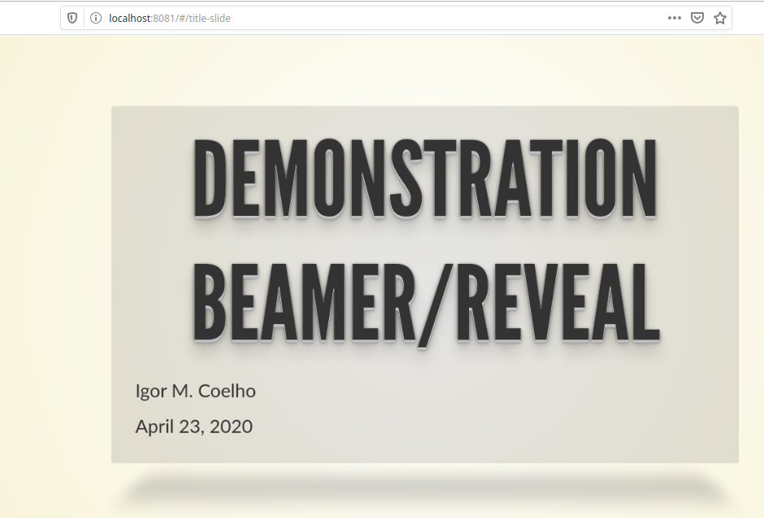
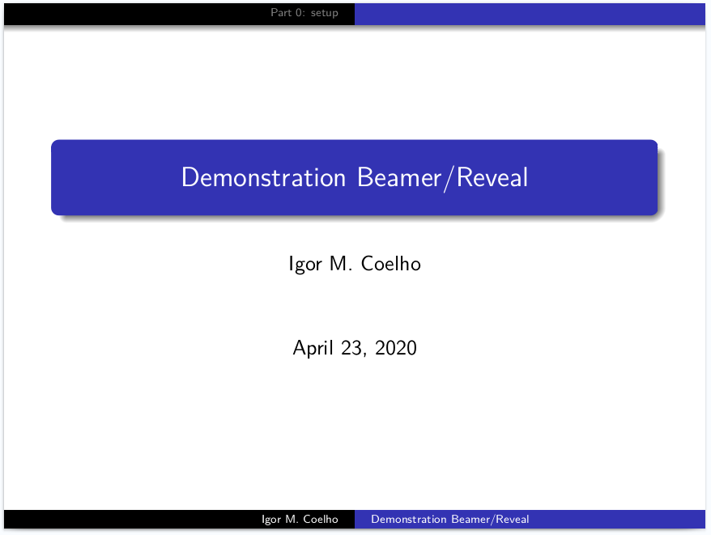

# Part 0: setup

-------

## Get Pandoc {.allowframebreaks}

This tutorial intends to provide interactive slides for lectures of 21st century.

We believe `Pandoc` is an amazing technology for it! Honestly, I love $\text{\LaTeX}$ and `beamer`, but this limits outputs to PDF.
Also, the ability to just write everything in `markdown` gets more and more attractive. Pandoc is able to automatically generate `beamer` code, and also to build nice interactive slides, such as `reveal.js`.

First of all, install Pandoc: `https://pandoc.org/`.

If you have time, read its MANUAL (a litle big as it covers all possible conversion formats): `https://pandoc.org/MANUAL`.

We focus on two formats: `beamer` and `revealjs`.

--------

## Editor Installation {.allowframebreaks}

One can use Atom, VSCode, Typora or any other markdown editors.

We use `Atom` with plugin `markdown-preview-enhanced` (but same plugin exists for `VSCode`).
The reason is that it supports more flavors of markdown, which approximates to pandoc dialect (although not perfect!).

--------

## Atom Configuration {.allowframebreaks}

If using `Atom`, do the following plugin configurations `Ctrl + ,`:

- `Math Rendering Option`-> `MathJax`
- `Pandoc Options Path` -> `/usr/bin/pandoc`
- `Pandoc Commandline Arguments` -> `--standalone, --filter=pandoc-katex, --css=katex.min.css`

This should allow $\text{\LaTeX}$ equations as $\sum_{i=0}^{n}\sqrt{i}$, which is a must!

------

## Testing Basic Configuration {.allowframebreaks}

Please enter this directory (we are assuming `linux` now).
We always assume two outputs will be generated: `beamer` (PDF) and `reveal.js` (JS).

The reason is that we still want to have a "stable" standalone (printable) version, while generating another equivalent interactive version.

You will need to setup a local browser, "thanks" to browser CORS (**absolutely no way around them!**): `python3 -m http.server 8081`

After that, you can type `make`.

------

## Standalone Preference {.allowframebreaks}

Note that we are interested in "standalone" and "self-contained" versions, at all costs (pandoc flags `--standalone` and `--self-contained`).
Internet may not be as widely available (during teaching, for example).
There may be however some limitations, for specific scenarios, where Internet will always be required.

We require downloading KaTeX css, its fonts, and also `reveal.js`.

------

## Beamer and Reveal Compatibility {.allowframebreaks}

To improve compatibility between beamer and reveal, we provide `beamer-reveal.css` file.

This setups fonts to be similar in both platforms, but this will certainly change when templates and other stuff change. Feel free to adjust it to your needs (adjust it to have a beautiful model!).

------

## Some Prints: Atom {.allowframebreaks}

This is how Atom editor looks like:

{width=80%}

------

## Some Prints: VSCode {.allowframebreaks}

This is how VSCode editor looks like:

{width=80%}

------

## Some Prints: Reveal.js {.allowframebreaks}

This is how Reveal.js looks like (over `http://localhost:8081`):

{width=80%}

------

## Some Prints: Beamer {.allowframebreaks}

This is how [Beamer PDF](./beamer-0-setup.pdf) looks like:

{width=80%}
