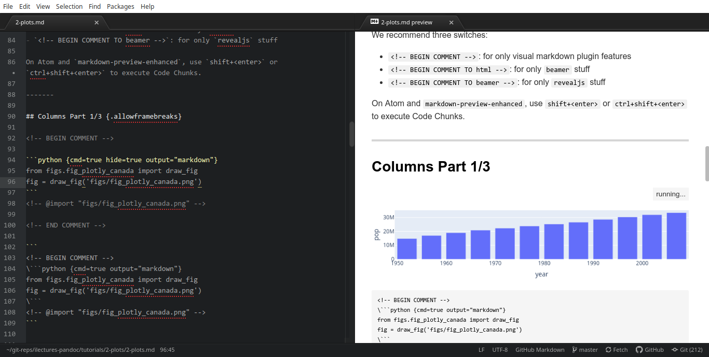

# Part 2: Plots

-------

## Creating Interactive Plots {.allowframebreaks}

One powerful approach on iLectures on Pandoc is to create plots and graphs that are interactive.
If we also want to be able to have a PDF-based version, the best library available seems to be [plotly](https://plotly.com).

We focus on two implementations of plotly:

- A Python version: [https://plotly.com/python/](https://plotly.com/python/)
- A JS version: [https://plotly.com/javascript/](https://plotly.com/javascript/)

We will need a pandoc filter for plots: [https://github.com/LaurentRDC/pandoc-plot](https://github.com/LaurentRDC/pandoc-plot).

We also provide a filter to switch between both versions: [comments-to.py](../../libs/comments-to.py).

-------

## Install Pandoc Plots {.allowframebreaks}

To install filter `pandoc-plot`, you will need [Anaconda3](https://anaconda.org) for many data science dependencies.

For Windows and Mac, you can find the plugin on [conda-forge](https://anaconda.org/conda-forge/pandoc-plot). For Linux, it's not available unfortunately. But you can directly download from github (or from [this project](../../libs/pandoc-plot)) and put on your project folder.

Install plotly deps: `conda install -c plotly plotly-orca`

Remember to do `conda activate`, otherwise you may still get errors like: `ModuleNotFoundError: No module named 'plotly'`.

------

## Options on Pandoc Plots {.allowframebreaks}

This amazing plugin allows several graphs (only `plotly` with interactive counterpart!):

- `plotly_python` : plots using the plotly Python library
- `plotly_r` : plots using the plotly R library
- `matplotlib`: plots using the matplotlib Python library
- `matlabplot`: plots using MATLAB
- `mathplot` : plots using Mathematica
- `octaveplot`: plots using GNU Octave
- `ggplot2`: plots using ggplot2
- `gnuplot`: plots using gnuplot
- and more...

You can get this information via `pandoc-plot --toolkits`.

-------

## Practical Examples {.allowframebreaks}

We consider Atom editor with `markdown-preview-enhanced`, which allows inline script execution ("Code Chunks"). Too bad that its syntax is not equivalent to `pandoc-plot`, so we will need to `comment` the visual part (during development) for it to "disappear" on generated `beamer`/`revealjs`.

For the Atom plugin: \`\`\``python {cmd=true}`\`\`\` and specially \`\`\``python {cmd=true hide=true output="markdown"}`\`\`\`

For the `pandoc-plot` and `beamer`: \`\`\``{.plotly_python caption="Figure caption"}`\`\`\`

For the JS and `revealjs`: an html `<script> ... </script>`.


-------

## Comment Switches {.allowframebreaks}

We recommend three switches:

- `<!-- BEGIN COMMENT -->`: for only visual markdown plugin features
- `<!-- BEGIN COMMENT TO html -->`: for only `beamer` stuff
- `<!-- BEGIN COMMENT TO beamer -->`: for only `revealjs` stuff

On Atom and `markdown-preview-enhanced`, use `shift+<enter>` or `ctrl+shift+<enter>` to execute Code Chunks.


# Columns Example

-------

## Columns Part 1/3 (a) {.allowframebreaks}

Only visible in Atom. See: [./figs/fig_plotly_canada.py](./figs/fig_plotly_canada.py).

<!-- BEGIN COMMENT -->

```python {cmd=true hide=true output="markdown"}
from figs.fig_plotly_canada import draw_fig
fig = draw_fig('figs/fig_plotly_canada.png')
```
<!-- @import "figs/fig_plotly_canada.png" -->

<!-- END COMMENT -->

```
<!-- BEGIN COMMENT -->
\```python {cmd=true output="markdown"}
from figs.fig_plotly_canada import draw_fig
fig = draw_fig('figs/fig_plotly_canada.png')
\```
<!-- @import "figs/fig_plotly_canada.png" -->
```

## Columns Part 1/3 (b) {.allowframebreaks}



-------

## Columns Part 2/3 {.allowframebreaks}

<!-- BEGIN COMMENT TO html -->

```{.plotly_python caption="This is a Plotly figure"}
from figs.fig_plotly_canada import draw_fig
fig = draw_fig('figs/fig_plotly_canada.png')
```

<!-- END COMMENT TO html -->

```
<!-- BEGIN COMMENT TO html -->
\`\`\`{.plotly_python caption="This is a Plotly figure"}
from figs.fig_plotly_canada import draw_fig
fig = draw_fig('figs/fig_plotly_canada.png')
\`\`\`
<!-- END COMMENT TO html -->
```

-------

## Columns Part 3/3 {.allowframebreaks}

<!-- BEGIN COMMENT TO beamer -->

<div id='tester2'></div>
<script type="module">
import {draw_fig} from './figs/fig_plotly_canada.js';
draw_fig( document.getElementById('tester2') );
</script>

<!-- END COMMENT TO beamer -->

```
<!-- BEGIN COMMENT TO beamer -->
<div id='tester2'></div> <script type="module">
import {draw_fig} from './figs/fig_plotly_canada.js';
draw_fig( document.getElementById('tester2') );
</script>
<!-- END COMMENT TO beamer -->
```

# Line Example

-------

## Line Part 1/3 (a) {.allowframebreaks}

Only visible in Atom. See: [./figs/fig_plotly_line1.py](./figs/fig_plotly_line1.py).

<!-- BEGIN COMMENT -->

```python {cmd=true hide=true output="markdown"}
from figs.fig_plotly_line1 import draw_fig
fig = draw_fig('figs/fig_plotly_line1.png')
```
<!-- @import "figs/fig_plotly_line1.png" -->

<!-- END COMMENT -->

```
<!-- BEGIN COMMENT -->
\```python {cmd=true hide=true output="markdown"}
from figs.fig_plotly_line1 import draw_fig
fig = draw_fig('figs/fig_plotly_line1.png')
\```
<!-- @import "figs/fig_plotly_line1.png" -->
<!-- END COMMENT -->
```

-------

## Line Part 2/3 (a) {.allowframebreaks}

```{.plotly_python caption="This is a Plotly figure"}
from figs.fig_plotly_line1 import draw_fig
fig = draw_fig('figs/fig_plotly_line1.png')
```

```
\```{.plotly_python caption="This is a Plotly figure"}
from figs.fig_plotly_line1 import draw_fig
fig = draw_fig('figs/fig_plotly_line1.png')
\```
```

-------

## Line Part 2/3 (b) {.allowframebreaks}

<!-- BEGIN COMMENT TO revealjs -->

```{.plotly_python caption="This is a Plotly figure"}
from figs.fig_plotly_line1 import draw_fig
fig = draw_fig('figs/fig_plotly_line1.png')
```
<!-- END COMMENT TO revealjs -->

This will not appear on revealjs, only beamer.

```
<!-- BEGIN COMMENT TO revealjs -->
\```{.plotly_python caption="This is a Plotly figure"}
from figs.fig_plotly_line1 import draw_fig
fig = draw_fig('figs/fig_plotly_line1.png')
\```
<!-- END COMMENT TO revealjs -->
```

See: [./figs/fig_plotly_line1.png](./figs/fig_plotly_line1.png).

-------

## Line Part 3/3 {.allowframebreaks}

<!-- BEGIN COMMENT TO beamer -->

<div id='tester3'></div>
<script type="module">
import {draw_fig} from './figs/fig_plotly_line1.js';
draw_fig( document.getElementById('tester3') );
</script>

<!-- END COMMENT TO beamer -->

See: [./figs/fig_plotly_line1.js](./figs/fig_plotly_line1.js).

```
<!-- BEGIN COMMENT TO beamer -->
<div id='tester3'></div> <script type="module">
import {draw_fig} from './figs/fig_plotly_line1.js';
draw_fig( document.getElementById('tester3') );
</script>
<!-- END COMMENT TO beamer -->
```


# More Columns Example

-------

## More Columns Part 1/3 {.allowframebreaks}

Figure only appears on Atom, after pressing `shift+<enter>`.
See: [./figs/fig_plotly_bar1.py](./figs/fig_plotly_bar1.py).


<!-- BEGIN COMMENT -->

```python {cmd=true hide=true output="markdown"}
from figs.fig_plotly_bar1 import draw_fig
fig = draw_fig('figs/fig_plotly_bar1.png')
```
<!-- @import "figs/fig_plotly_bar1.png" -->

<!-- END COMMENT -->

```
<!-- BEGIN COMMENT -->
\```python {cmd=true hide=true output="markdown"}
from figs.fig_plotly_bar1 import draw_fig
fig = draw_fig('figs/fig_plotly_bar1.png')
\```
<!-- @import "figs/fig_plotly_bar1.png" -->
<!-- END COMMENT -->
```

-------

## More Columns Part 2/3 (a) {.allowframebreaks}

```{.plotly_python caption="This is a Plotly figure"}
from figs.fig_plotly_bar1 import draw_fig
fig = draw_fig('figs/fig_plotly_bar1.png')
```

Code:
```
\```{.plotly_python caption="This is a Plotly figure"}
from figs.fig_plotly_bar1 import draw_fig
fig = draw_fig('figs/fig_plotly_bar1.png')
\```
```

-------

## More Columns Part 2/3 (b) {.allowframebreaks}

See file `figs/fig_plotly_bar1.py`.

```python
import plotly.express as px
import plotly as plotly
import plotly.graph_objects as go

def draw_fig(filename):
	animals=['giraffes', 'orangutans', 'monkeys']
	fig = go.Figure([go.Bar(x=animals, y=[20, 14, 23])])
	fig.update_layout( margin=dict(l=0, r=0, t=50, b=0) )
	fig.write_image(filename)
	return fig
```

-------

## More Columns Part 3/3 (a) {.allowframebreaks}

This will not appear on beamer, only on revealjs.
See: [./figs/fig_plotly_bar1.js](./figs/fig_plotly_bar1.js).  

<!-- BEGIN COMMENT TO beamer -->

<div id='tester4'></div>
<script type="module">
import {draw_fig} from './figs/fig_plotly_bar1.js';
draw_fig( document.getElementById('tester4') );
</script>

<!-- END COMMENT TO beamer -->

-------

## More Columns Part 3/3 (b) {.allowframebreaks}

```
<!-- BEGIN COMMENT TO beamer -->
<div id='tester4'></div>
<script type="module">
import {draw_fig} from './figs/fig_plotly_bar1.js';
draw_fig( document.getElementById('tester4') );
</script>
<!-- END COMMENT TO beamer -->
```

-------

## More Columns Part 3/3 (c) {.allowframebreaks}

See `./figs/fig_plotly_bar1.js`.

```js
export function draw_fig(field) {
  Plotly.newPlot(field, [{
      x: ['giraffes', 'orangutans', 'monkeys'],
      y: [20, 14, 23],
      type: 'bar'
    }]);
}
```

# Finish

## Try more formats

Feel free to try other plot formats and technologies.

### Learning more
Please contribute with us if you find more nice things!
