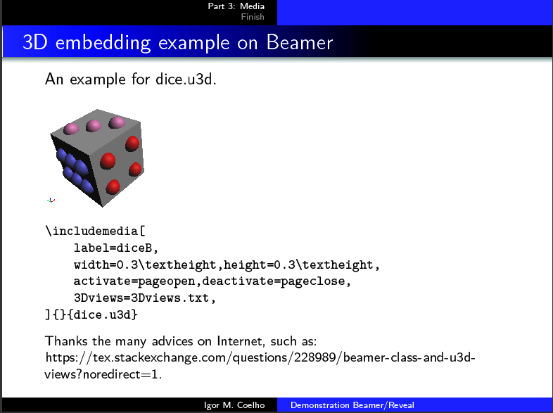
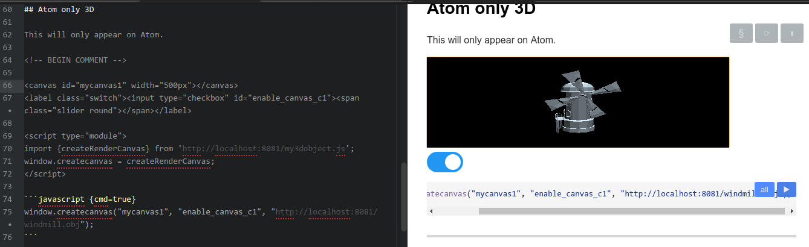

# Part 3: Media


-------

## Adding Sound and 3D Media

We discuss possibilities for adding audio, video and 3d models on `beamer` and `revealjs` slides.


# Sound

-----

## Adding Sound Media

To add HTML5 embeddings, such as audios, one can do with `<audio>` tag. This is not visible on `beamer`.

<!-- BEGIN COMMENT TO beamer -->

<audio controls="1">
  <source src="https://www.soundhelix.com/examples/mp3/SoundHelix-Song-1.mp3"
          data-external="1" type="audio/mpeg" />
</audio>

<!-- END COMMENT TO beamer -->

\footnotesize

```
<audio controls="1">
  <source src="https://www.soundhelix.com/examples/mp3/
	                            SoundHelix-Song-1.mp3"
          data-external="1" type="audio/mpeg" />
</audio>
```

# 3D on Beamer

-------

## 3D embedding on PDFs

For multimedia and Beamer, it is recommended the `media9` LaTeX package (old `movie15` package).

Not that maximum version of Adobe Player supported is 9.4.1:
- `ftp://ftp.adobe.com/pub/adobe/reader/unix/9.x/9.4.1/enu/` (after 9.5 it will not work!).

This also requires flash-player. Sometimes it crashes with `beamer`, thus it's certainly not a solid technology for the future.

On next slide, you will see a 3D dice, as long as you have Adobe 9.4.1 and Flash.

## 3D embedding example on Beamer

An example for [dice.u3d](./dice.u3d).

<!-- BEGIN COMMENT TO revealjs -->

\includemedia[
	label=diceB,
	width=0.3\textheight,height=0.3\textheight,
	activate=pageopen,deactivate=pageclose,
	3Dviews=3Dviews.txt,
]{}{dice.u3d}

<!-- END COMMENT TO revealjs -->

::: {.block}

\footnotesize

```
\includemedia[
	label=diceB,
	width=0.3\textheight,height=0.3\textheight,
	activate=pageopen,deactivate=pageclose,
	3Dviews=3Dviews.txt,
]{}{dice.u3d}
```

:::

Thanks the many advices on Internet, such as: [https://tex.stackexchange.com/questions/228989/beamer-class-and-u3d-views?noredirect=1](https://tex.stackexchange.com/questions/228989/beamer-class-and-u3d-views?noredirect=1).


-------

## 3D as an image

Beamer PDF: `acroread` [beamer-3-media.pdf](beamer-3-media.pdf)



This also requires a `.u3d` model, which can be generated by [MeshLab](https://github.com/cnr-isti-vclab/meshlab/). See Linux version: [MeshLab AppImage](https://github.com/cnr-isti-vclab/meshlab/releases/download/Meshlab-2020.04/MeshLab2020.04-linux.AppImage).


# 3D on Reveal.js

-------

## Atom-only 3D

This will only appear on Atom.

*Thanks a lot to this [three.js tutorial](https://threejsfundamentals.org/threejs)*.  

<!-- BEGIN COMMENT -->

<canvas id="mycanvas1" width="500px"></canvas>
<label class="switch"><input type="checkbox" id="enable_canvas_c1"><span class="slider round"></span></label>

<script type="module">
import {createRenderCanvas} from 'http://localhost:8081/my3dobject.js';
window.createcanvas = createRenderCanvas;
</script>
<script type="module">
import {createRenderCanvas} from 'https://igormcoelho.github.io/ilectures-pandoc/tutorials/3-media/my3dobject.js';
window.createcanvas = createRenderCanvas;
</script>
<link rel="stylesheet" type="text/css" href="cslider.css">

```javascript {cmd=true}
window.createcanvas("mycanvas1", "enable_canvas_c1", "http://localhost:8081/windmill.obj");
window.createcanvas("mycanvas1", "enable_canvas_c1", "https://igormcoelho.github.io/ilectures-pandoc/tutorials/3-media/windmill.obj");
```

<!-- END COMMENT -->



To see this example on Atom, execute `make run` or any local server to `http://localhost:8081`, due to CORS (or optionally, a [hardcoded web link]("https://igormcoelho.github.io/ilectures-pandoc/tutorials/3-media")).


-------

## Atom-only 3D (source-code)

\footnotesize

```
<!-- BEGIN COMMENT -->
<canvas id="mycanvas1" width="500px"></canvas>
<label class="switch"><input type="checkbox" id="enable_canvas_c1"><span class="slider round"></span></label>
<script type="module">
import {createRenderCanvas} from 'http://localhost:8081/my3dobject.js';
window.createcanvas = createRenderCanvas;
</script>
\```javascript {cmd=true}
window.createcanvas("mycanvas1", "enable_canvas_c1", "http://localhost:8081/windmill.obj");
\```
<!-- END COMMENT -->
```

*Again, thanks a lot to this [three.js tutorial](https://threejsfundamentals.org/threejs)*, which have been compressed in this helper script [my3dobject.js](my3dobject.js), for object model [windmill.obj](windmill.obj).

See: [https://threejsfundamentals.org/threejs/lessons/threejs-load-obj.html](https://threejsfundamentals.org/threejs/lessons/threejs-load-obj.html).


-------

## JS-only 3D

This will not appear on beamer, only on revealjs.

<!-- BEGIN COMMENT TO beamer -->

<canvas id="mycanvas" width="500px"></canvas>
<label class="switch"><input type="checkbox" id="enable_canvas_c"><span class="slider round"></span></label>

<script type="module">
import {createRenderCanvas} from './my3dobject.js';
createRenderCanvas("mycanvas", "enable_canvas_c", "./windmill.obj");
</script>

<!-- END COMMENT TO beamer -->

# Videos

-------

## Video Embedding with HTML5 {.allowframebreaks}


<!-- BEGIN COMMENT TO beamer -->

<video src="http://v2v.cc/~j/theora_testsuite/320x240.ogg" controls>
  Your document does not support  <code>video</code>.
</video>

<!-- END COMMENT TO beamer -->

```
<!-- BEGIN COMMENT TO beamer -->
<video src="http://v2v.cc/~j/theora_testsuite/320x240.ogg" controls>
  Your document does not support  <code>video</code>.
</video>
<!-- END COMMENT TO beamer -->
```

# Finish

## Try more formats

Feel free to try other plot formats and technologies.

### Learning more
Please contribute with us if you find more nice things!
